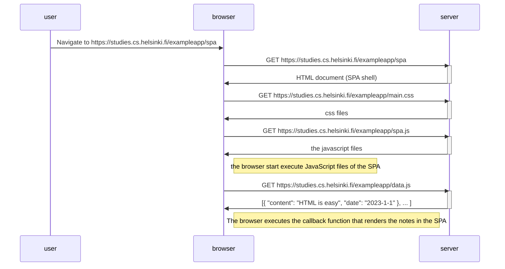

```mermaid

sequenceDiagram
    participant user
    participant browser
    participant server

    user ->>browser: Navigate to https://studies.cs.helsinki.fi/exampleapp/spa 

    browser->>server: GET https://studies.cs.helsinki.fi/exampleapp/spa

    activate server
    server->>browser: HTML document (SPA shell)
    deactivate server

    browser->>server: GET https://studies.cs.helsinki.fi/exampleapp/main.css
    activate server
    server->>browser: css files 
    deactivate server

    browser->>server: GET https://studies.cs.helsinki.fi/exampleapp/spa.js
    activate server
    server->>browser: the javascript files 
    deactivate server

    Note right of browser: the browser start execute JavaScript files of the SPA

    browser->>server: GET https://studies.cs.helsinki.fi/exampleapp/data.js
    activate server
    server->>browser: [{ "content": "HTML is easy", "date": "2023-1-1" }, ... ]
    deactivate server
    
    Note right of browser: The browser executes the callback function that renders the notes in the SPA

```