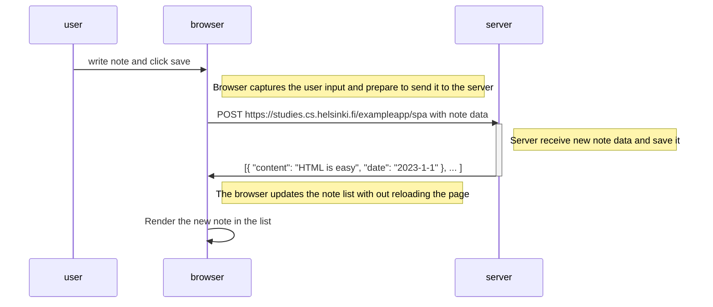

```mermaid

sequenceDiagram
    participant user
    participant browser
    participant server

    user ->>browser: write note and click save
    Note right of browser: Browser captures the user input and prepare to send it to the server

    browser->>server: POST https://studies.cs.helsinki.fi/exampleapp/spa with note data

    activate server
    Note right of server: Server receive new note data and save it
    server ->>browser: [{ "content": "HTML is easy", "date": "2023-1-1" }, ... ]
    deactivate server

    Note right of browser: The browser updates the note list with out reloading the page
    browser->>browser: Render the new note in the list
```